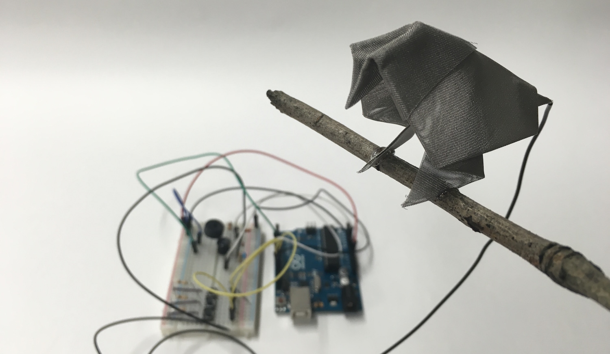

# Touché Birdy

A touch sensitive bird using [Illutron](https://github.com/Illutron/AdvancedTouchSensing)'s Arduino implementation of Disney's [Touché project](https://www.disneyresearch.com/project/touche-touch-and-gesture-sensing-for-the-real-world/).

This implementation improves on the original by reading more frequencies, which should result in greater accuracy. The current value is 200, as used by Disney, but can be increased.

## Hardware

Hardware setup based on project by [Studio NAND](https://github.com/StudioNAND/tact-hardware).
With additional buttons connected to pins 10, 11 and 12 for on-board gesture recognition ([Arduino Button tutorial](https://www.arduino.cc/en/Tutorial/Button)).

## Modes

The hardware can optionally do on board gesture recognition, or send all the values via Serial to Processing (or other software).

On board gesture recognition is *enabled* by default, it can be disabled by commenting out the line 

    #define NUM_GESTURES 3

Serial sending is *disabled* by default, it can enabled by uncommenting the line 

    // #define SEND 1

This will send the all read values, with corresponding frequencies. See `SendData.ino` for encoding details and `SerialLink.pde` for decoding details.

## Gestures

Gestures are trained by pressing the corresponding button while touching your antennae *important:* release the button before letting go of the antennae.

The current gesture is represented as an `uint8_t`, and will be passed to the `gestureResponse` function (`Gestures.ino`) along with the time the gesture started in milliseconds.

### Gestures.ino

There are two main functions to use:

    void gestureSetup()

Which is where you can put in any setup code, this is called by Arduino's `void setup()` function.

    void gestureResponse(uint8_t gesture, uint32_t gestureStartTime)

This function will be passed the current gesture, and the time it started. Keep your code clean by switching on the gesture and writing separate functions for each gesture. If you want to use your own responses, you can delete `getCurrentBeat`, `touchResponse`, and `grabResponse`.

## Project by

- [Arthur Carabott](http://www.arthurcarabott.com)
- [Svenja Richter](http://svenjarichter.com/)